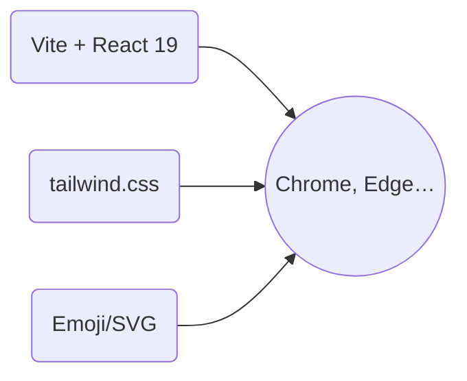

# OpenAI Full‑Stack Demo

*Interactive showcase of OpenAI Chat, DALL·E 3, TTS, Whisper & Moderation APIs (React + Express)*

---

## Data Flow & Architecture
```mermaid
flowchart TD
    subgraph Browser (React SPA @ Vite)
        A[Home → /Chat / Dalle / TTS / Whisper / Moderate / Docs]
        B(User Input)
    end
    subgraph Express API Layer
        C[/index.js/]
        D[/routes/chat.js/]
        E[/routes/dalle.js/]
        F[/routes/tts.js/]
        G[/routes/whisper.js/]
        H[/routes/moderation.js/]
        I[OpenAI SDK]
        J[uploads/*]
    end

    B--POST /api/chat-->D
    B--POST /api/dalle-->E
    B--POST /api/tts-->F
    B--POST /api/whisper-->G
    B--POST /api/moderate-->H

    D & E & F & G & H--->I
    G--stores tmp-->J
    G--cleanup-->J
    C--JSON Back-->A
```

---

## Project Overview
This repository contains a **full‑stack demo application** showcasing multiple OpenAI capabilities:

* A **React (19) + Vite** single‑page front‑end with Tailwind CSS & animated UI cards.  
* A **Node.js (Express 5) backend** that proxies five REST endpoints to OpenAI’s GPT‑4o family: Chat Completions, DALL·E 3 image generation, Text‑To‑Speech, Whisper speech‑to‑text and Content Moderation.

Everything runs locally with zero external database dependencies—perfect for rapid prototyping, hack‑days or teaching.

---

## Features
| Feature | Description |
|---------|-------------|
| 💬 **Chatbot** | Conversational endpoint using `gpt‑3.5‑turbo` (easy to swap for `gpt‑4o`). |
| 🎨 **DALL·E 3** | Generates 1024×1024 images from text prompts. |
| 🔊 **Text‑To‑Speech** | Converts text into MP3 in‑memory using `tts‑1` (`voice: nova`). |
| 🎤 **Whisper STT** | Upload audio → returns transcription (`whisper‑1`), temp file auto‑cleanup. |
| 🛡️ **Moderation** | Flags harmful content with **omni‑moderation‑latest**. |
| ⚡ **Vite + Tailwind** | Instant reload, responsive dark‑mode design & floating SVG shapes. |
| 🔐 **.env Support** | Keep your `OPENAI_API_KEY` out of source control. |
| 🌐 **Proxy Dev Server** | `/api/*` requests are proxied to `localhost:5050` during `npm run dev`. |

---

## Directory Structure
```txt
root
├── Client/                 # React ℹ️
│   ├── src/components/     # Chat, Dalle, TTS, Whisper, Moderation, Docs
│   ├── index.html
│   └── tailwind.config.js
├── Server/                 # Express API
│   ├── routes/             # chat.js • dalle.js • tts.js…
│   ├── uploads/            # transient audio files
│   └── index.js            # entry‑point
└── README.md               # ← you are here
```

---

## Quick Start

```bash
# 1. Clone
git clone https://github.com/you/openai-demo.git
cd openai-demo

# 2. Set secrets
echo "OPENAI_API_KEY=sk‑..." > .env

# 3. Install deps
npm install     # root dev deps (lint etc.)
cd Server && npm install
cd ../Client && npm install

# 4. Run both servers (two terminals)
cd Server && node index.js          # → http://localhost:5050
cd Client && npm run dev            # → http://localhost:5173
```

---

## Scripts

<details>
<summary>Client <code>package.json</code></summary>

```jsonc
"scripts": {
  "dev": "vite",
  "build": "vite build",
  "lint": "eslint .",
  "preview": "vite preview"
}
```
</details>

<details>
<summary>Server <code>package.json</code></summary>

```jsonc
"scripts": {
  "start": "node index.js"
}
```
</details>

---

## API Reference

### POST `/api/chat`
```jsonc
{ "messages": [ { "role": "user", "content": "Hello!" } ] }
```
→ `200 { "response": "Hi there 👋" }`

---

### POST `/api/dalle`
```jsonc
{ "prompt": "A neon robot reading a book" }
```
→ `200 { "image": "https://..." }`

---

### POST `/api/tts`
```jsonc
{ "text": "Hello world" }
```
Response: `audio/mpeg` (MP3 buffer).

---

### POST `/api/whisper`
*Multipart form‑data* with **`audio`** file →  
`200 { "text": "…transcription…" }`

---

### POST `/api/moderate`
```jsonc
{ "input": "Some text to audit" }
```
→ `200 { "flagged": false, "categories": { ... } }`

---

## Static Asset Pipeline


---

## Screenshots
| Home (Light) | Chat (Dark) |
|--------------|-------------|
| _Add your screenshots here_ | _Add your screenshots here_ |

---

## Contributing
1. **Fork** the repo  
2. `git checkout -b feat/my‑awesome‑feature`  
3. Commit with [Conventional Commits](https://www.conventionalcommits.org)  
4. Open a PR – a template will guide you.

Please **do not commit `.env`** or any secret keys.

---

## License
[MIT](LICENSE) © 2025 Your Name

---

> _Built with 🧡 & ☕ – last updated 2025._
