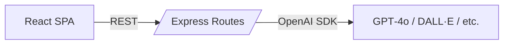

<p align="center">
  <!-- ⇣⇣  Replace with your screenshots ⇣⇣ -->
  
  
</p>

# UNCC × OpenAI **Playground**

> A compact teaching repo that walks Charlotte 49ers through crafting **AI‑powered** web apps with the OpenAI API, React + Vite on the front‑end, and an Express API on the back.

---

## 🎨 Flow (Client ⇄ Server ⇄ OpenAI)

---

## 🔌 API Cheatsheet

| Route | Body | Returns |
|-------|------|---------|
| `POST /api/chat` | `{ messages:[...] }` | `{ response }` |
| `POST /api/dalle` | `{ prompt }` | `{ image }` |
| `POST /api/tts` | `{ text }` | `audio/mp3` |
| `POST /api/whisper` | `FormData audio` | `{ text }` |
| `POST /api/moderate` | `{ input }` | `{ flagged, categories }` |

---

## 🍀 Why this project?

* **Made for the classroom** – every line is commented so beginner devs can follow along.
* **Full‑stack, zero‑DB** – deploy anywhere without a database.
* **One repo, many demos** – Chat, DALL·E, Moderation, Whisper & TTS.
* **Tailwind flair** – modern components + fun floating shapes.

---

## 🚀 Quick Start

```bash
# 1. Clone & install (root dir installs both client & server)
git clone https://github.com/your‑org/uncc-openai-demo.git
cd uncc-openai-demo

# 2. Add your key
echo "OPENAI_API_KEY=sk-..." > Server/.env

# 3. Dev servers (concurrently)
npm run dev         # Client (Vite) on :5173
npm --workspace=Server start   # API on :5050
```

---

## 🗂️ Directory Glimpse

```txt
root
├── Client   # React + Vite SPA
│   └── src/components   # Chat, DALL·E, etc.
└── Server   # Express API routes
    ├── routes/chat.js
    └── ...              # dalle.js, tts.js, whisper.js, moderation.js
```

---

## 📜 License

MIT – reuse for labs, hackathons, or your next side‑quest.

*Built with 💚 at the University of North Carolina at Charlotte*
